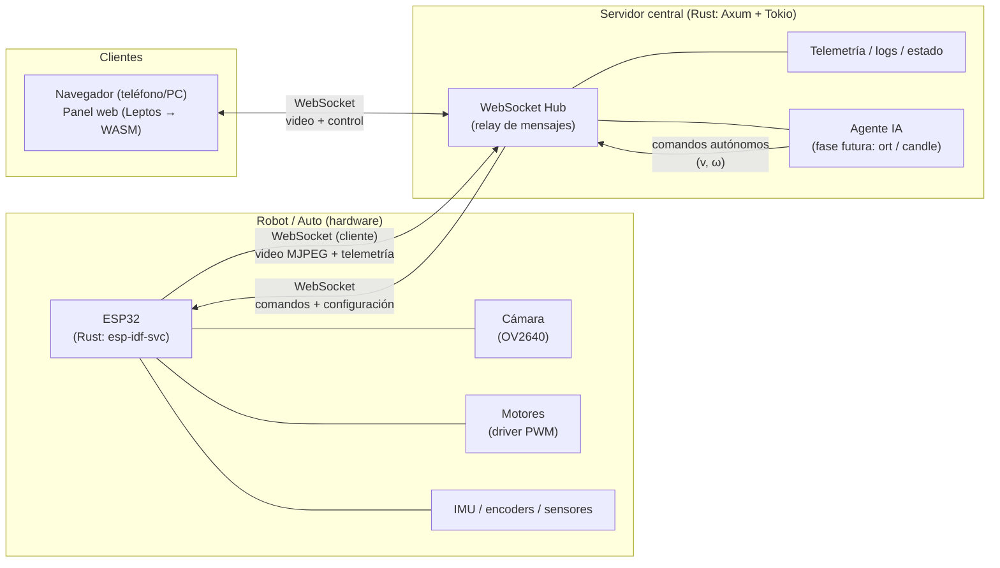
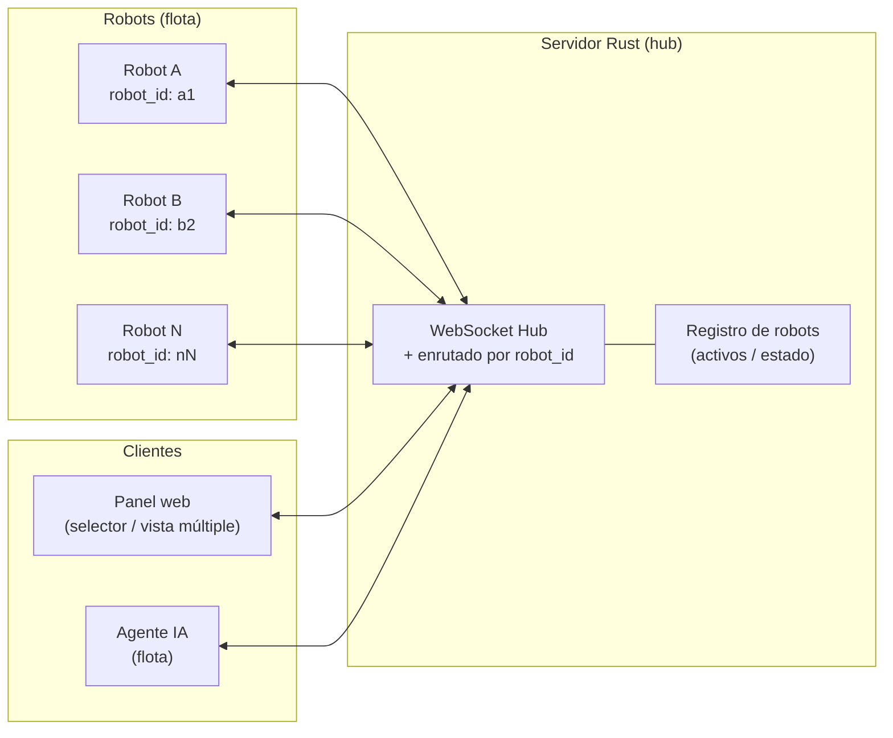
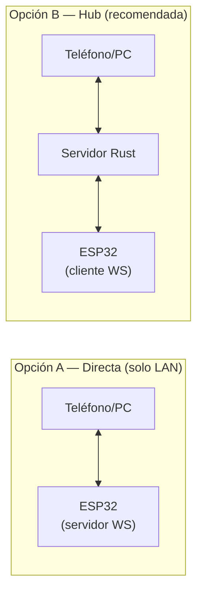
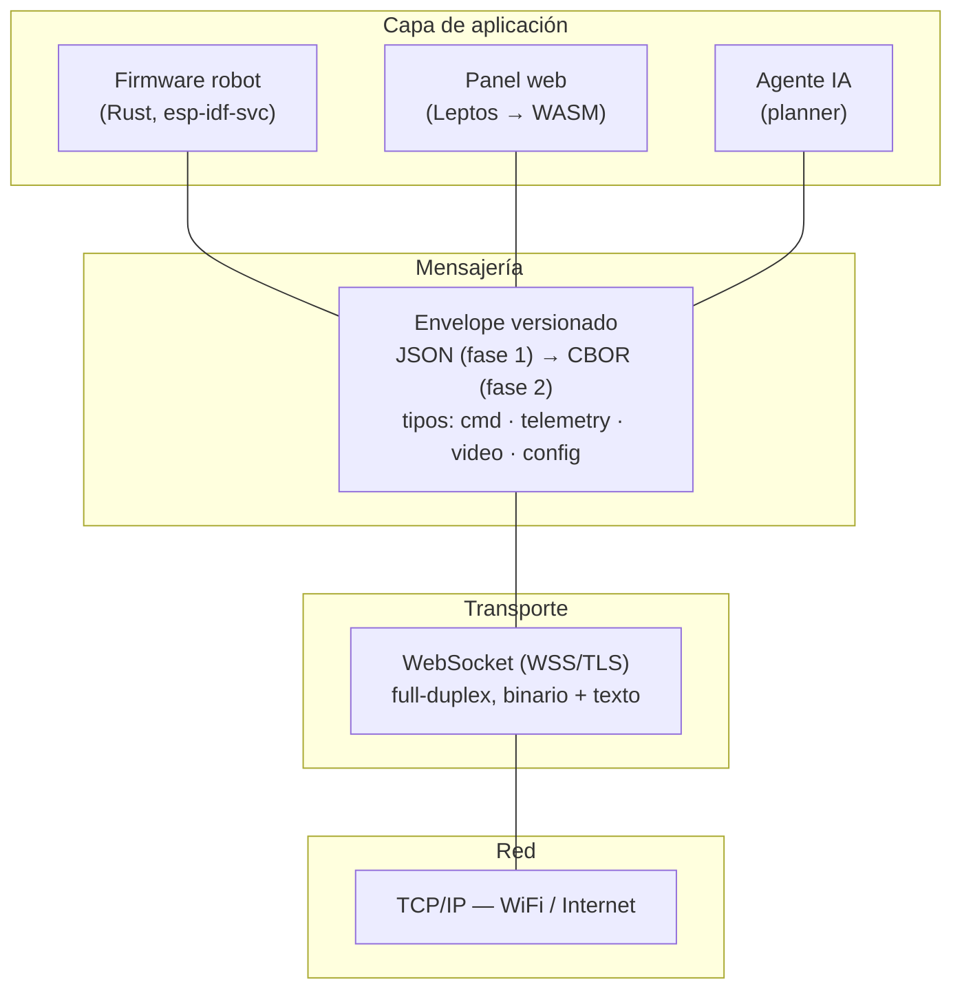
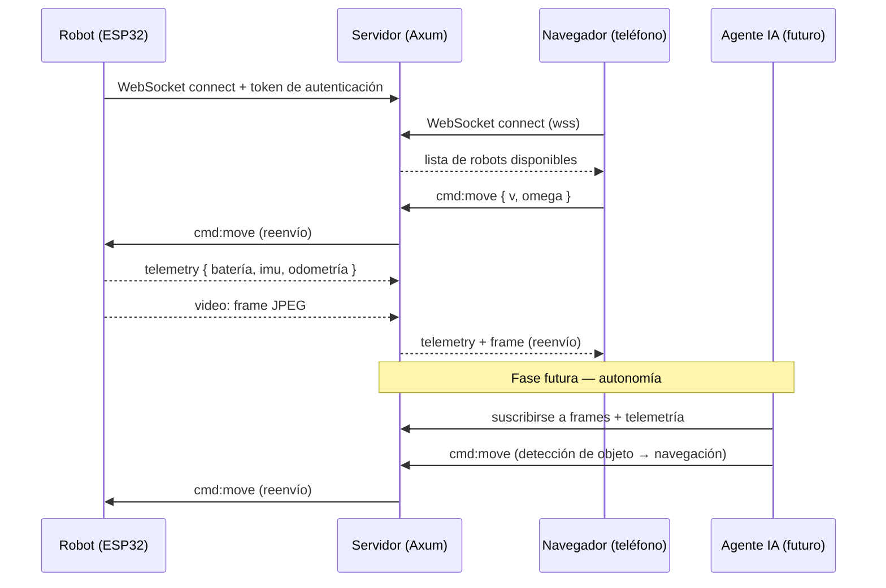
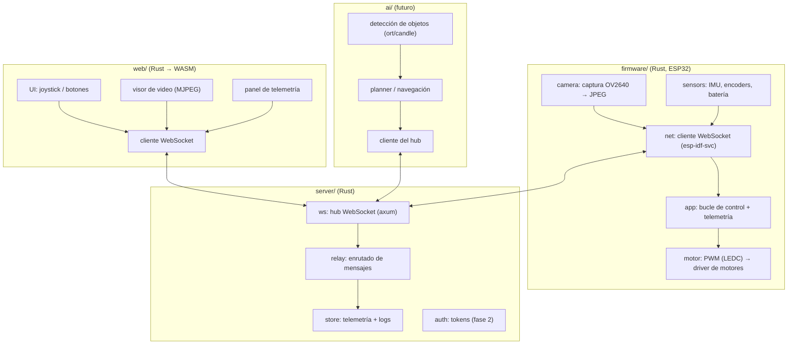

# Arquitectura y protocolos — ESP32 Robot

> Documento de diseño. Acompaña a [`README.md`](../README.md).
> Los diagramas están en **Mermaid** (se renderizan en GitHub, VS Code y la mayoría de visores).

---

## 1. Resumen de la recomendación

**Arquitectura:** *hub* — un servidor central en Rust hace de intermediario entre el robot, el
navegador y el futuro agente de IA. El ESP32 es **cliente WebSocket** del servidor (no expone un
servidor propio). Esto simplifica NAT/red, permite múltiples clientes y deja la IA en el servidor.

**Protocolo:** **WebSocket** como canal principal (control + telemetría + video MJPEG).
- Alternativa considerada y descartada para el canal principal: **MQTT** (excelente para telemetría
  IoT pub/sub, pero malo para video de baja latencia y no es nativo del navegador).
- Evolución opcional: **WebRTC** para video de muy baja latencia cuando MJPEG no alcance.

---

## 2. Arquitectura general



**Reglas de diseño clave:**

- El **ESP32 abre** la conexión WebSocket hacia el servidor (cliente). El servidor **nunca** inicia
  la conexión con el robot. Esto evita problemas de NAT/firewall y de IP dinámica.
- El **navegador** se conecta al servidor por `wss://` (o `ws://` en LAN).
- El **servidor** reenvía (`relay`) mensajes entre los extremos y además los registra/expone a la IA.
- El **agente IA** es un cliente más del hub: consume video + telemetría y publica comandos como si
  fuera un operador humano.

### 2.1 Escalado a múltiples robots (flota)

El modelo **hub** está diseñado para crecer a una **flota**: cada robot se registra con un
identificador único y el servidor enruta los mensajes por ese ID, sin cambiar la topología ni el
protocolo.



**Mecánica para soportar varios robots:**

- **Identidad:** cada ESP32 recibe un `robot_id` único (y su token). Lo envía al conectar.
- **Enrutado:** el envelope incluye `robot_id` (y `to`/`from`). Un comando se dirige a un robot
  concreto, o se **difunde a todos** (p. ej. "detener flota").
- **Suscripción:** telemetría y video van etiquetados con `robot_id`; el navegador o la IA se
  suscriben a uno o varios robots.
- **Interfaz:** el panel web añade un **selector de robot** (o vista en rejilla / pestañas) para
  controlar varios desde la misma página.
- **Flota autónoma:** el agente IA puede lanzar un planner por robot (o un coordinador de flota).

---

## 3. Topologías comparadas



| Criterio | A. Directa | B. Hub (recomendada) |
|----------|-----------|----------------------|
| Latencia local | Muy baja (sin intermediario) | Baja (+1 salto) |
| Nº de clientes | 1 (o pocos) | Muchos |
| Acceso remoto (fuera de LAN) | Difícil (NAT, IP pública) | Fácil (el robot sale hacia el servidor) |
| Agente IA | Limitado en el ESP32 | Natural: corre en el servidor |
| Registro/replay de datos | No | Sí (telemetría y frames) |
| Complejidad | Baja | Media |
| Robustez | Sin dependencia externa | Depende del servidor |

**Conclusión:** usar **B (hub)** como arquitectura principal y, opcionalmente, mantener **A** como
modo de desarrollo/offline local.

---

## 4. Pila de protocolos



### 4.1 Transporte — WebSocket

- **Por qué:** full-duplex, baja latencia, soporte nativo en el navegador y disponible en Rust tanto
  en el servidor (`axum` + `tokio-tungstenite`) como en el ESP32 (`esp-idf-svc`).
- **Modo binario:** para frames de video (JPEG) y payloads binarios.
- **Modo texto:** para comandos/telemetría JSON legibles durante el desarrollo.

### 4.2 Video — MJPEG → (opcional) WebRTC

- **Fase 1 — MJPEG:** cada frame JPEG se envía como mensaje binario de WebSocket. Simple y
  suficiente para 10–20 FPS a resolución baja/media. No requiere códecs en el ESP32.
- **Fase 2 — WebRTC:** si se necesita latencia < 100 ms o mayor resolución/FPS. Requiere
  *signaling* (el servidor Rust ya puede hacerlo) y es costoso para el ESP32; considerar un
  compañero con más cómputo (p. ej. CM4 o ESP32-P4) o bajar a WebSocket con MJPEG optimizado.

### 4.3 Control y telemetría — mensajes versionados

Envelope común, con `type` + `id` + timestamp + `payload`:

```json
{
  "type": "cmd:move",
  "id": "c1f2-...",
  "ts": 1725123456,
  "robot_id": "a1",
  "payload": { "v": 0.5, "omega": 0.2 }
}
```

**Tipos de mensaje (v0):**

| Tipo | Dirección | Descripción |
|------|-----------|-------------|
| `cmd:move` | navegador/IA → robot | Velocidad lineal `v` y angular `omega` (drive diferencial). |
| `cmd:stop` | navegador/IA → robot | Parada de emergencia. |
| `cmd:camera` | navegador → robot | Cambiar resolución/FPS/calidad. |
| `telemetry` | robot → servidor/navegador | Batería, corriente de motores, IMU, odometría, RSSI, CPU. |
| `video` | robot → servidor/navegador | Frame JPEG (binario) + metadatos (resolución, ts). |
| `config` | servidor → robot | Parámetros (límites de velocidad, PIDs, etc.). |
| `ping` / `pong` | ambos | Latido y medición de latencia. |

> Todos los mensajes incluyen `robot_id` (o `to`/`from`) para enrutar en una flota de varios robots.

> Mantener `version` en el envelope (o negociar en el *handshake*) para evolucionar el esquema sin
> romper compatibilidad.

---

## 5. Diagrama de secuencia (operación normal)



---

## 6. Componentes por capa (vista de implementación)



---

## 7. Seguridad

- **Fase 1 (LAN):** `ws://` sin autenticación, para desarrollo.
- **Fase 2 (remoto):** `wss://` (TLS con `rustls`) + token de autenticación en el *handshake* del
  WebSocket; roles (operador vs. IA) y límite de comandos (rate limiting).
- Nunca exponer el ESP32 directamente a Internet.

---

## 8. Roadmap sugerido

| Fase | Alcance | Entregable |
|------|---------|------------|
| 0 | Validar hardware y decisiones abiertas | Documento actualizado |
| 1 (MVP) | Firmware: motores + WebSocket; servidor: hub; web: control básico | Teleoperación LAN |
| 2 | Cámara MJPEG + visor en la web | Video en vivo |
| 3 | Telemetría completa + persistencia | Panel de estado |
| 4 | Seguridad (WSS + auth) | Acceso remoto |
| 5 | Agente IA: detección de objetos | Identificación en vivo |
| 6 | Planner autónomo | Movimiento independiente |

---

## 9. Riesgos y decisiones abiertas

- **Latencia de video en ESP32:** MJPEG puede quedar corto; tener WebRTC como plan B.
- **Recursos del ESP32:** cámara + WiFi + WebSocket + control compiten por CPU/memoria; definir
  FPS/resolución objetivos.
- **Carga del servidor:** el relay de video escala con el número de clientes; considerar
  *fan-out* binario o un *media server* dedicado si crece.
- **Sincronización de comandos:** definir política de prioridad (operador vs. IA) y *watchdog*
  de parada si se pierde la conexión.
- **Modelo de cámara y motores por confirmar** (ver README §8).
